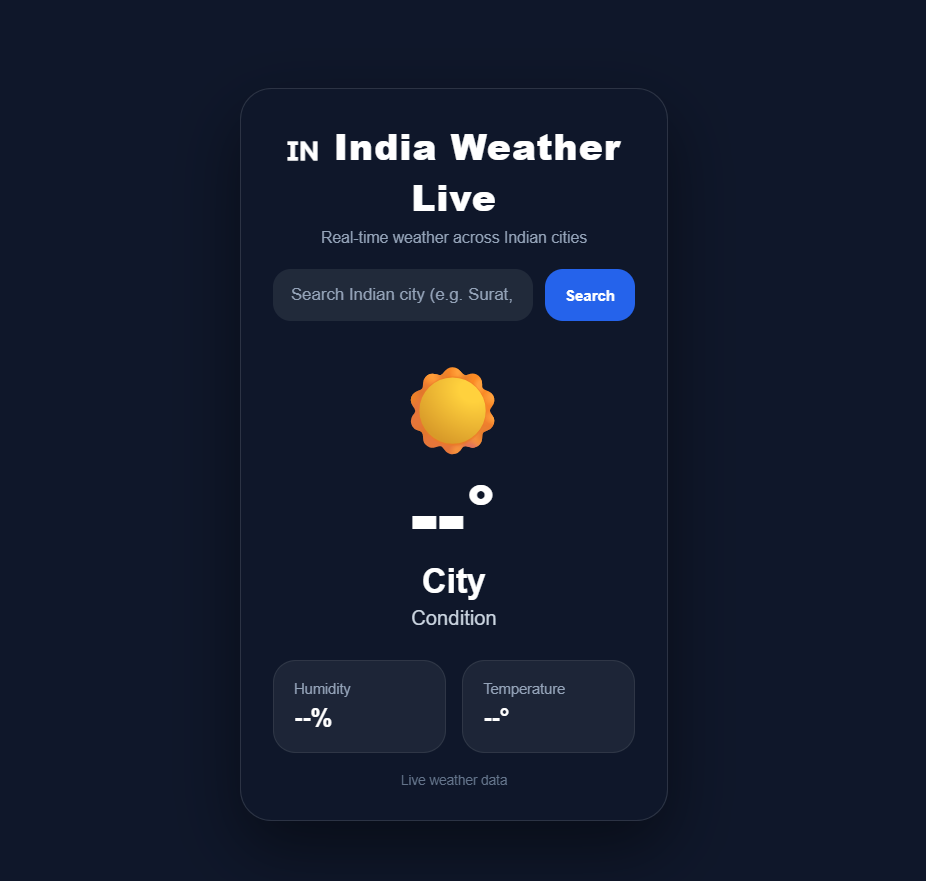
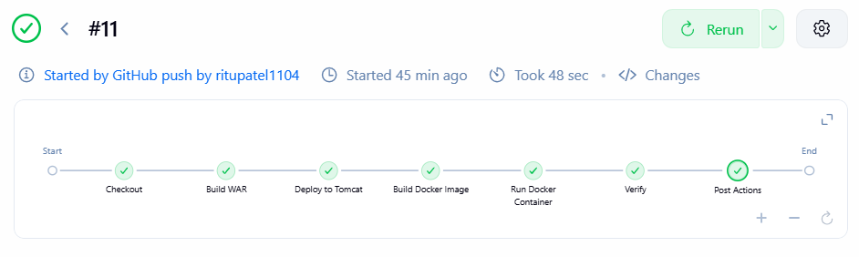
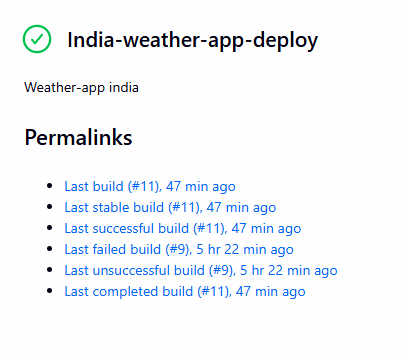
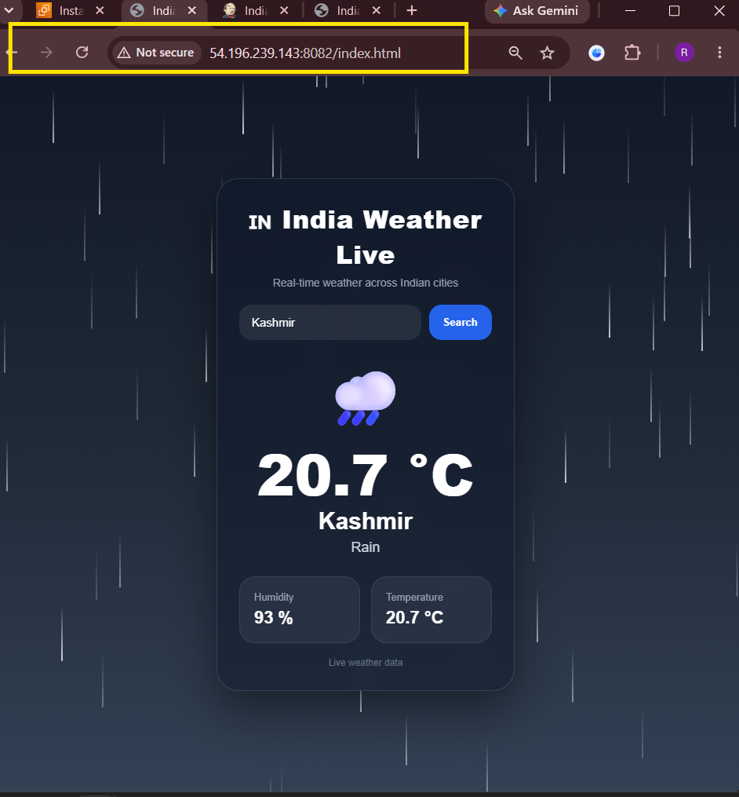

# 🌦️ India Weather Live

<p align="center">
  <b>🚀 Production-Style Spring Boot Weather Application with Automated CI/CD Pipeline using Jenkins, Docker, Apache Tomcat, and AWS EC2</b>
</p>

<p align="center">
  <i>Real-time weather updates • Automated deployments • Dockerized infrastructure • Cloud-hosted on AWS</i>
</p>

---

## 📌 Project Overview

**India Weather Live** is a modern and responsive weather web application built with **Spring Boot** and **Java 21**. The application fetches **real-time weather data** from the **Open-Meteo API** and presents it through a clean, user-friendly interface.

Users can search weather information for any city and instantly view current atmospheric conditions.


## 🖼️ Application Preview

### 🌤️ Weather App & Jenkins Pipeline

| Weather App UI | Jenkins Pipeline |
|---|---|
|  |  |

---

### 🟢 Jenkins Build & Docker Deployment

| Jenkins Build Success | Docker Deployment |
|---|---|
|  |  |

---

### 🖥️ Tomcat Deployment



## 🛠️ Tech Stack

| Layer | Technology |
|---|---|
| 🎨 **Frontend** | HTML5, CSS3, JavaScript |
| ⚙️ **Backend** | Spring Boot 3.5.5, Java 21 |
| 📦 **Build Tool** | Maven |
| 🐳 **Containerization** | Docker |
| 🔁 **CI/CD** | Jenkins Declarative Pipeline |
| 🌐 **Application Server** | Apache Tomcat 10 |
| ☁️ **Cloud Platform** | AWS EC2 (Ubuntu) |
| 🌦️ **Weather API** | Open-Meteo API |


## ✨ Features

| Feature | Description |
|---|---|
| 🔍 **Search by City** | Search weather information for any city |
| 🌡️ **Live Temperature** | Displays real-time temperature data |
| 💧 **Humidity Info** | Shows current humidity percentage |
| ☁️ **Dynamic Weather** | Updates weather conditions dynamically |
| 📱 **Responsive UI** | Works smoothly on desktop and mobile devices |
| 🔁 **Automated CI/CD** | Jenkins pipeline builds and deploys automatically |
| 🐳 **Dockerized Deployment** | Application packaged and deployed using Docker |
| 🖥️ **Tomcat Deployment** | WAR file deployed on Apache Tomcat 10 |
| 🔔 **Webhook Integration** | GitHub webhook triggers Jenkins pipeline automatically |

## 🚀 End-to-End CI/CD Workflow & Architecture

```text
Developer Pushes Code
        │
        ▼
GitHub Repository
        │
        ▼
GitHub Webhook Trigger
        │
        ▼
Jenkins Declarative Pipeline
        │
        ├── Checkout Source Code
        ├── Maven Build
        ├── Run Unit Tests
        ├── Package WAR File
        ├── Deploy to Apache Tomcat (8082)
        ├── Build Docker Image
        └── Run Docker Container (8081)
                 │
                 ▼
           AWS EC2 Instance
```


## 🐳 Docker Deployment

The application is containerized using **Docker** and published on **Docker Hub**.

### 📦 Published Image

```text
ritika1104/weather-app-india:latest
```

### 📥 Pull the Docker Image

```bash
docker pull ritika1104/weather-app-india:latest
```

### ▶️ Run the Container

```bash
docker run -d -p 8081:8080 --name weather-app ritika1104/weather-app-india:latest
```


### 📌 Deployment Summary

- **Tomcat Deployment:** Port **8082**
- **Docker Deployment:** Port **8081**
- **Jenkins Dashboard:** Port **8080**
- **Cloud Platform:** AWS EC2 (Ubuntu)
- **Deployment Type:** Automated via Jenkins Pipeline
